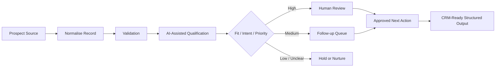

# B2B AI Lead Qualification — Portfolio Showcase

> **Portfolio showcase only.** This repository documents the architecture and decision logic of a real B2B prospect qualification workflow. It intentionally does **not** contain production prospect data, LinkedIn exports, personal contact details, message history, private scoring rules, prompts, credentials, endpoints, CRM records, or deployable production workflows.

## Project goal

Large B2B prospect lists quickly become difficult to review consistently. The business problem is not simply finding contacts; it is deciding which opportunities deserve attention, what kind of follow-up is appropriate, and when a human should take over.

This project structures that process as an AI-assisted qualification workflow.

## Capabilities demonstrated

- B2B lead intake and normalisation
- AI-assisted qualification
- rule-based and contextual classification
- priority scoring
- intent / fit assessment
- recommended next action
- human-in-the-loop approval
- CRM-ready structured output
- duplicate / incomplete record handling
- audit-friendly qualification states
- workflow automation design
- safe handling of personal and commercial data

## High-level architecture

The public diagram shows the workflow pattern, not the proprietary scoring or outreach methodology.

## What the workflow evaluates

Depending on the use case, qualification can consider structured signals such as:

- company / role relevance;
- market and geography;
- stated business objective;
- product / service fit;
- expansion intent;
- partnership potential;
- response content;
- urgency;
- data completeness;
- prior interaction status.

The exact production rules and scoring thresholds remain private.

## Human-in-the-loop principle

AI can accelerate review, but commercially important decisions should not be delegated blindly.

The workflow therefore separates:

1. **machine-assisted classification**;
2. **human validation**;
3. **approved commercial action**.

This is particularly important when a contact may represent a strategic partner, qualified buyer, distributor, supplier or high-value consulting opportunity.

## CRM-ready, not CRM-dependent

The system is designed to produce structured records that can be mapped into a CRM or another operational system.

This public showcase does not claim a specific CRM deployment. Instead, it demonstrates a provider-neutral output contract that can include:

- qualification status;
- fit category;
- priority;
- rationale;
- next recommended action;
- follow-up state;
- review flag.

## My role

**AI Automation Consultant & Workflow Designer**

I translated a real B2B business-development process into a structured qualification model, defined decision states, human review points, safe data boundaries and the output needed for downstream sales operations.

## Design principles

1. **Qualification before outreach scale**
2. **Structured decisions instead of free-form AI opinions**
3. **Human approval for high-value or ambiguous leads**
4. **No automatic action on incomplete records**
5. **Personal data minimisation**
6. **Clear status and next-action fields**
7. **CRM-neutral output**
8. **Auditable reasoning without exposing private prompts**

## What is intentionally not public

- prospect names or profiles
- LinkedIn exports
- email addresses or phone numbers
- conversation history
- private lead lists
- scoring weights
- production prompts
- outreach templates
- account / campaign identifiers
- CRM credentials
- webhook URLs
- production workflow JSON
- internal commercial tags
- client information

## Commercial use

This repository is a portfolio case study, not an open-source lead-generation system.

The architecture can be adapted to B2B sales teams, agencies, exporters, consultants, manufacturers and market-development projects that need to turn large prospect lists into a controlled qualification pipeline.
